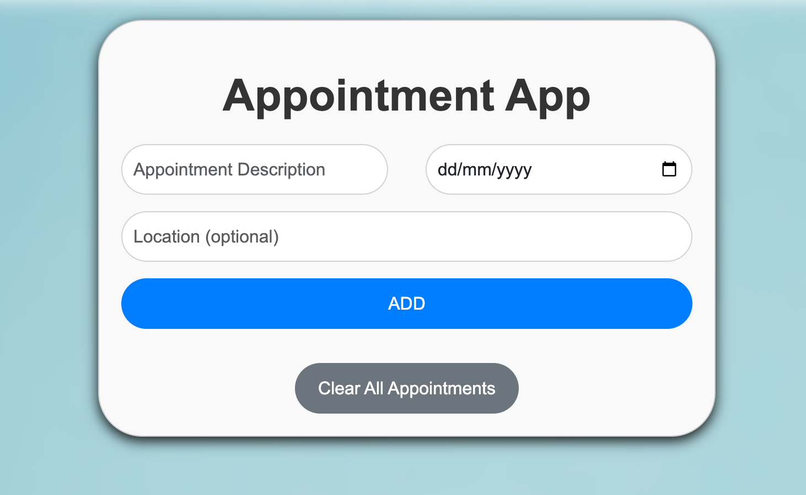

# Angular Appointment App

This is a simple Angular application for managing appointments. Users can add new appointments with descriptions, dates, and optional locations. They can also view a list of existing appointments and delete appointments as needed.

## Features

- **Create New Appointment**: Users can add new appointments by entering a description, date, and optional location. Pressing Enter in any input field will add the appointment.
- **View Appointment List**: Existing appointments are displayed in a list, showing their title, date (formatted as "dd.MM.yyyy"), and location (if provided).
- **Delete Appointments**: Each appointment item includes a "DELETE" button to remove the appointment from the list.
