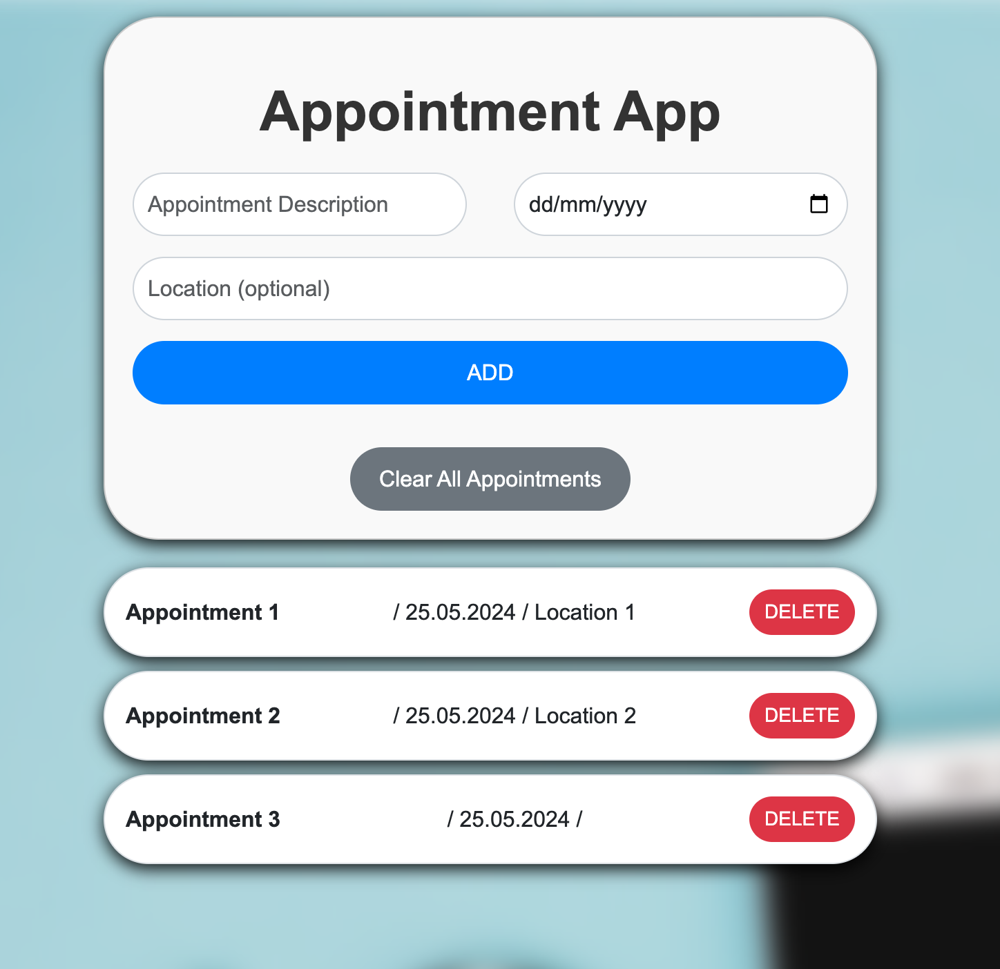

# Angular Appointment App

This is a simple Angular application for managing appointments. Users can add new appointments with descriptions, dates, and optional locations. They can also view a list of existing appointments and delete appointments as needed.




## Features

- **Create New Appointment**: Users can add new appointments by entering a description, date, and optional location. Pressing Enter in any input field will add the appointment.
- **View Appointment List**: Existing appointments are displayed in a list, showing their title, date (formatted as "dd.MM.yyyy"), and location (if provided).
- **Delete Appointments**: Each appointment item includes a "DELETE" button to remove the appointment from the list. Pressing Backspase will delete the last appointment.
- **Clear All Appointments**: User can clear all appointments from the list

## Installation

To run the Angular Weather App locally, follow these steps:

1. Clone the repository:
   ```bash
   git clone https://github.com/romanospapanikolaou/angular-appointment-app.git
   ```
2. Navigate to the project directory:
   ```bash
   cd angular-appointment-app
   ```
3. Install dependencies:
   ```bash
   npm install
   ```
4. Start the development server:
   ```bash
   ng serve
   ```
5. Open your browser and navigate to [http://localhost:4200/](http://localhost:4200/) to view the app.

## Usage

Once the application is running, follow these steps to use the appointment app:

1. **Add an appointment:**

   - Enter the appointment details in the input field.
   - Press Enter or click the "Add" button to add the appointment to the list.

2. **Delete an appointment:**

   - Hover over the appointment you want to delete.
   - Click on the delete icon to remove the task from the list or press backspace.

## Contributing

Contributions are welcome! If you'd like to contribute to this project, feel free to submit a pull request. For major changes, please open an issue first to discuss the proposed changes.

1. Fork the repository.
2. Create a new branch (`git checkout -b feature`)
3. Make your changes.
4. Commit your changes (`git commit -am 'Add new feature'`)
5. Push to the branch (`git push origin feature`)
6. Create a new Pull Request.

## Acknowledgements

- Background picture by [Freepik](https://www.freepik.com/).
- Built with [Angular](https://angular.io/) and [Bootstrap](https://getbootstrap.com/).
